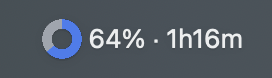
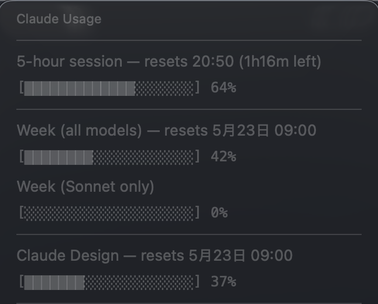

# claude-usage-bar

A SwiftBar plugin that shows your Claude Code usage (5-hour session and weekly) in the macOS menu bar as a percentage.



- Left: a donut chart of the current 5-hour session utilization
- Middle: utilization as a percentage
- Right: time remaining until that session resets

Clicking the menu bar item reveals a dropdown with the 5-hour and weekly utilization, reset times, and per-model weekly breakdown. The text turns orange at 70% and red at 90%.



## How it works

The plugin calls the same internal endpoint `https://api.anthropic.com/api/oauth/usage` that Claude Code's `/usage` slash command uses, so the numbers match `/usage` exactly.

- **Auth**: reads the Claude Code OAuth access token from the macOS Keychain entry `Claude Code-credentials` via the `security` command.
- **Aggregation**: done server-side by Anthropic — no local log parsing.
- **Dependencies**: `python3`, `security` (both standard on macOS once Xcode Command Line Tools are installed).

> [!NOTE]
> `/api/oauth/usage` is not a publicly documented API — it's an internal endpoint used by Claude Code. It may change or be removed in future Claude Code releases.

## Requirements

- macOS (requires the `security` CLI and `python3` from Xcode Command Line Tools)
- Homebrew
- Logged into Claude Code (so the OAuth token is stored in the Keychain)

## Setup

```sh
brew install --cask swiftbar

# Clone this repo anywhere
git clone https://github.com/d-mato/claude-usage-bar ~/Projects/claude-usage-bar
chmod +x ~/Projects/claude-usage-bar/claude-usage.5m.py

# Launch SwiftBar and pick a Plugin Folder when prompted
# (existing users: skip this — your Plugin Folder is already set)
open -a SwiftBar

# Symlink the script into your SwiftBar Plugin Folder
ln -s ~/Projects/claude-usage-bar/claude-usage.5m.py \
      "$(defaults read com.ameba.SwiftBar PluginDirectory)/"
```

The symlink approach lets `git pull` update the plugin in place and keeps the script next to other SwiftBar plugins you may already have.

### First-run Keychain prompt

The first time SwiftBar runs the plugin, macOS will show a dialog like:

> "SwiftBar" wants to access the keychain item "Claude Code-credentials".

Click **Always Allow**. Choosing **Allow** alone will re-prompt every refresh.

## Display

| Location | Content |
|---|---|
| Menu bar | `37% · 2h24m` (5-hour session utilization + time remaining) |
| Dropdown | 5-hour session and weekly utilization (all models / Opus / Sonnet), reset times |

## Troubleshooting

- **`Claude ⚠️` in the menu bar**: open the dropdown to see the error. Usually it's a Keychain denial or an expired token.
- **`OAuth token expired`**: run `claude` in a terminal to re-login.
- **`Keychain access denied`**: open Keychain Access.app, find `Claude Code-credentials`, and add SwiftBar to the Access Control list.
- **Stale numbers**: pick Refresh from the menu, or wait 5 minutes. To change the refresh interval, rename the `5m` part of the filename (e.g. to `1m`).

## Version history

- **v0.1**: aggregated local logs via `ccusage`. Retired because its numbers drifted tens of percent from the official `/usage`.
- **v0.2**: switched to calling the official `/api/oauth/usage` endpoint directly.

## License

MIT — see [LICENSE](LICENSE).
